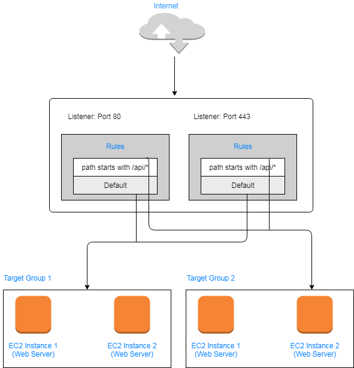

# AWS-WebAppSynchronousDecoupling
Web Application configured with ALB and Auto-Scaling (Supports Synchronous Decoupling)

Web Application configured Load Balancer in front of an auto-scaling group to decouple traffic to web servers and also to remove a dependency between the application users and the EC2 instance’s public IP address. The auto-scaling group makes ensure that two web servers are always running.

If a new EC2 instance is started, the auto-scaling group registers the EC2 instance with the ALB and deregister EC2 instances that have been removed.

